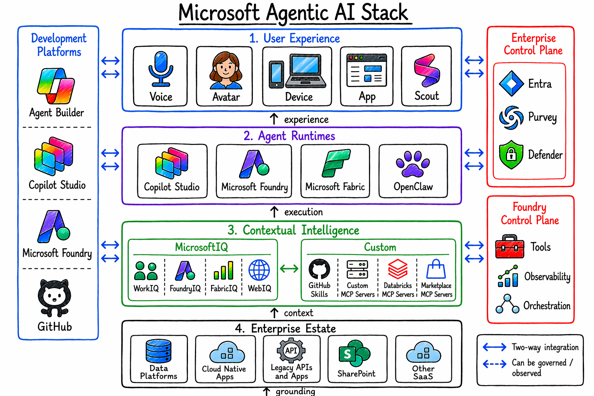
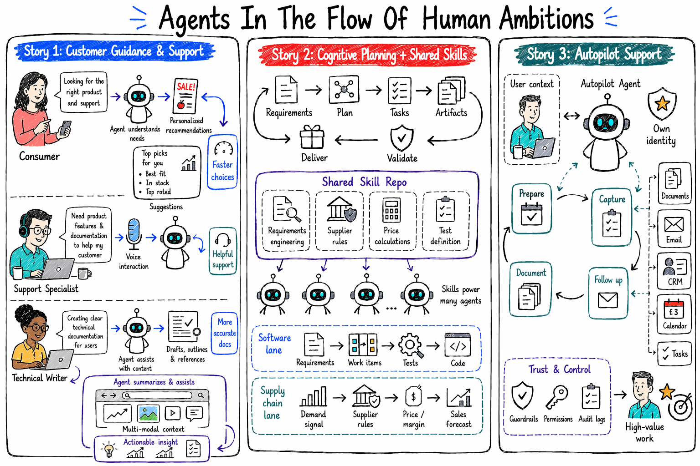

# Build 2026 - recap

Talking points.

After Build 2026 the agentic stack has consolidated into a clear set of layers: grounding and data services, tools surfaced over MCP, agents running across different runtimes, and a control plane that governs identity and observability. The picture below shows how these pieces fit together.

Agentic scenarios are end-to-end use cases where reasoning agents combine skills, tools, and runtimes to go from research all the way to action. The diagram below frames the kinds of problems we can now solve when agents are given grounded knowledge and governed tools.

Focus on three stories:

## 1. Where can agents run and how can they connect to retrieve context

The `story-telling` repo tells one story: how the same skills and tools are reused everywhere while the runtime — prompt agent, hosted container, or sandbox — is chosen to fit the job. It starts with an ingestion agent that classifies source URLs and writes them into Azure AI Search, turning that knowledge into a Research MCP server that any agent can call. From there agents put it to work across different runtimes, which is exactly what the three stories below illustrate. Code and narrative: https://github.com/denniszielke/story-telling

**a.) How to run agents in containers and connect to Foundry.** Hosted agents are packaged as containers, built on ACR and deployed into Azure AI Foundry, where they call models and the shared toolbox over MCP. This lets you bring your own framework — Agent Framework, LangGraph, or a sandboxed OpenClaw agent — while still benefiting from Foundry's managed model access and identity.

**b.) Running agents in Foundry.** A lightweight prompt agent acts as a concierge that classifies intent and routes to specialist hosted agents, each exposed over Responses, A2A, and Invocations. Every agent's managed identity is granted the Azure AI User role at the project scope so it can reach both models and the toolbox without secrets.

**c.) How to build an autopilot in Foundry.** The most advanced runtime runs an OpenClaw agent entirely inside an Azure Container Apps Sandbox, so it never touches your machine and exposes its canvas and A2UI surfaces through a gateway. This is the pattern for autonomous, long-running autopilots that need an isolated execution environment.

## 2. How can agents collaborate and integrate into user experiences

The `voice-product-support` repo wires the same bike-support domain up repeatedly through different protocols (MCP, A2A, Responses, Invocations) so the trade-offs between them become concrete rather than abstract. It is organised in three layers — user experiences, agents, and context providers — with voice as the connecting thread that shows how existing agents collaborate to fulfil more complex tasks. Code and narrative: https://github.com/denniszielke/voice-product-support

**a.) What is the difference between voice and realtime.** VoiceLive provides managed STT, LLM, and TTS bound directly to a Foundry agent, while the realtime path gives you lower-level control over the audio stream. Choosing between them comes down to how much orchestration you want the platform to manage versus how much latency and control your scenario demands.

**b.) Integration between VoiceLive, agents, and tools.** VoiceLive streams spoken turns and UI click events into the same agent endpoint, and the agent emits both spoken text deltas and custom UI events back to the caller. The agents reach enterprise data through MCP — for example a bike-rental MCP server and a Foundry toolbox wrapping Bing Custom Web Search — so tools are governed centrally rather than wired point-to-point.

**c.) Dealing with encoding for special scenarios.** For low-latency browser experiences a WebRTC peer connection carries audio (RTP plus a data channel) directly to Voice Live, while a signaling proxy tunnels the control WebSocket and attaches the Entra ID authorization header that browsers cannot set themselves. This is the pattern to reach for when binary PCM streaming and real-time UX matter more than simplicity.

## 3. What needs to be done to operate agents in an enterprise

The `agentic-supply-chain` repo shows a retail scenario where weekly promotional flyers are ingested, indexed, and exposed as governed tools, then a set of agents — some hosted in Foundry, some external — reason over that data for both shoppers and the marketing team. Its architecture has four layers: a grounding layer, a tool layer of MCP servers surfaced as Foundry toolboxes, an agent layer, and a control plane spanning Foundry and Agent 365 for identity, governance, and observability. Code and narrative: https://github.com/denniszielke/agentic-supply-chain/

**a.) How to leverage Microsoft IQ for grounding agents.** A FoundryIQ knowledge base aggregates the supplier, category, and item search indexes as knowledge sources to enable agentic retrieval — multi-hop reasoning across all three in a single query. Comparing this knowledge base against calling the individual search tools directly makes the quality improvement from grounding visible.

**b.) Integrating an agent and tools in the enterprise control plane.** Tools are published once as Foundry toolboxes — Entra-authenticated MCP endpoints — so they are discovered and governed centrally; the same pricing MCP server is registered both as a Foundry toolbox and as a bring-your-own tool in Agent 365. This means one server stays governable from both control planes at the same time.

**c.) Build an autopilot and register it in Agent 365.** The campaign agent is onboarded into Agent 365 with its own Managed Agent Identity, participates in agentic notifications, and emits traces to Agent 365 observability using an exchanged agentic token. An external Agent Framework workflow can likewise be registered as a Foundry external agent, surfacing its OpenTelemetry traces in the Foundry control plane.
